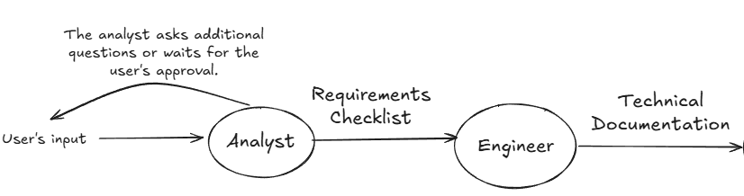
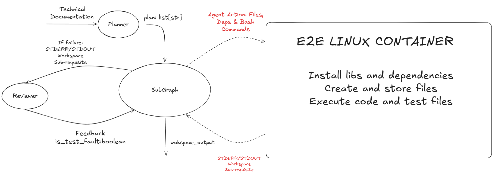

# TDD Agents

<div align="center">


**An autonomous, multi-agent orchestration of the Test-Driven Development (TDD) lifecycle, utilizing isolated cloud sandboxing to transform technical specifications into software through iterative 'Red-Green-Refactor' cycles.**

</div>

---

## 📋 Table of Contents

- [Overview](#-overview)
- [How It Works](#-how-it-works)
  - [Phase 1 — Requirements Gathering](#phase-1--requirements-gathering-the-product-team)
  - [Phase 2 — The TDD Engineering Loop](#phase-2--the-tdd-engineering-loop)
- [Key Features](#-key-features)
- [The Agent Team](#-the-agent-team)
- [Project Structure](#-project-structure)
- [Getting Started](#-getting-started)
  - [Prerequisites](#prerequisites)
  - [Installation](#installation)
- [Usage](#-usage)
  - [Execution Flags](#execution-flags)
- [Output & Deliverables](#-output--deliverables)
- [License](#-license)

---

## Overview

**Test-Driven Development Agents** is an experimental, multi-phase software engineering pipeline prototype orchestrated entirely by AI agents, designed to autonomously analyze requirements, generate tests, implement code, and iteratively refine solutions.

The core differentiator lies in its **Test-Driven Development (TDD) enforcement cycle**, combined with a **cloud-based Linux sandbox** that securely executes code generation, testing, and validation in an isolated environment.

Our pipeline follows the guidelines proposed by the standard TDD workflow:

```

  🔴 RED            🟢 GREEN          🔵 REFACTOR

  ─────────         ─────────         ───────────

  Tester writes  →  Developer writes  →  Reviewer assesses 
  a failing test    minimum code to      the generated code
                    statisfy the test    and requests refactoring                        
```

To guarantee reliability, the system executes agent-generated code inside secure **E2B sandbox environments** using the E2B Code Interpreter runtime. This ensures safe execution in the cloud and keeps dependencies and the file system isolated from the host. The workflow is managed by a **LangGraph** state machine backed by PostgreSQL, allowing the pipeline to handle interruptions, persist agent memory, and resume execution seamlessly without data loss.

---

## How It Works

Built on **LangGraph**, the pipeline operates in three stages: first, it collaborates with the user to consolidate technical specifications, second, it launches an autonomous team of agents to implement the code via Test-Driven Development, and third, the results are evaluated by a Quality agent.

---

### Phase 1 — Requirements Gathering

Before a single line of code is written, the system engages the user in a collaborative validation loop. An AI Analyst actively refines the scope by asking clarifying questions and incorporating feedback or warnings, strictly awaiting the user's explicit approval on the final checklist. Once confirmed, these requirements are handed to an Engineer Agent, who authors the formal Technical Specification that serves as the blueprint for the subsequent autonomous TDD stage.



| Step | Agent | Action |
|------|-------|--------|
| **1** | **Requirements Analyst** | Interviews the user to surface ambiguities. Produces a validated checklist of functional and non-functional requirements. |
| **2** | **Requirements Engineer** | Converts the checklist into a formal, structured **Technical Specification** (Markdown). |

---

### Phase 2 — The TDD Engineering Loop

Once the technical specification is approved, the orchestration transitions to the **Planner Agent**, which is responsible for decomposing the documentation into atomic, testable sub-requirements. Each sub-requirement is then executed within a specialized **SubGraph** that encapsulates the State Machine governing the "Red-Green-Refactor" workflow.

To ensure enterprise-grade reliability, every architectural decision and code change is persisted in a **PostgreSQL** database via a unique **thread_id**, allowing the system to recover seamlessly from interruptions without data loss.

The process operates within a strict execution loop:

1. **Tester Agent**: Receives a sub-requirement and the current workspace to generate or update test files.

2. **Red Phase**: Executes the tests in an isolated E2B Cloud Sandbox to confirm failure against the current implementation, ensuring the test is valid and not a false positive.

3. **Reviewer Agent**: Analyzes execution logs and stack traces to provide technical insights and feedback.

4. **Developer Agent**: Utilizes the sub-requirements, Reviewer conclusions, and the workspace to implement the minimum code necessary to satisfy the tests.

5. **Green Phase**: Re-executes the test suite in the sandbox to validate the new implementation. If all tests pass, the cycle advances to the next sub-requirement.

If either the Red or Green phase fails to meet the TDD criteria, the **Reviewer Agent** acts as the primary judge, performing **Intelligent Fault Attribution**. By analyzing the stack trace and the codebase, it dynamically routes the workflow back to either the Tester (to fix flawed tests or imports) or the Developer (to correct the logic), ensuring every requirement is fully validated.

The **Runner Agent** is responsible for orchestrating the execution of agent-generated code within an isolated E2B Cloud Sandbox. It serves as the bridge between the LLM's logic and a real Linux environment, executing the specific commands and functions required to validate both the Red Phase (confirming a failing test) and the Green Phase (verifying the implementation). By managing the sandbox lifecycle, the Runner ensures that every test is performed in a deterministic, secure, and clean environment, returning the exact **stdout** and **stderr** logs needed for the **Reviewer** to perform fault attribution.



### Phase 3 — Quality assessement

---

## ✨ Key Features

| Feature | Description |
|---------|-------------|
| 🛡️ **Real Execution Environment** | Code is never "hallucinated." Every test runs inside a real, isolated E2B Linux container. Dependencies are installed via `pip`. Results are deterministic. |
| 🧠 **Intelligent Fault Attribution** | The Reviewer agent distinguishes between *bad implementation* and *bad tests* by analyzing the full traceback — routing the fix to the correct agent automatically. |
| 💾 **State Persistence & Resumability** | PostgreSQL checkpoints the full LangGraph state after every node. Stop execution at any time and resume exactly where you left off using a Thread ID. |
| 🔄 **Self-Healing Retry Loop** | When tests fail, agents read the error output, reason about the root cause, apply a targeted fix, and re-execute — iterating until resolution or escalation. |
| 📊 **Automated Quality Reports** | Upon completion, `CodeMetric-AI` generates a final audit log with Cyclomatic Complexity scores, SOLID principle adherence, and architectural notes. |
| 🗂️ **Structured Output Delivery** | All generated source code and test suites are extracted from the Sandbox and saved locally to `./workspace_output/` for immediate use. |

---

## 🧩 The Agent Team

```
  ╔═════════════╦══════════════════╦═══════════════════════════════════════════════════════╗
  ║   AGENT     ║   ROLE           ║   RESPONSIBILITY                                      ║
  ╠═════════════╬══════════════════╬═══════════════════════════════════════════════════════╣
  ║  Analyst    ║  Product Manager ║  Converses with user. Clarifies "What" and "Why".     ║
  ║             ║                  ║  Produces a validated requirements checklist.          ║
  ╠═════════════╬══════════════════╬═══════════════════════════════════════════════════════╣
  ║  Engineer   ║  Tech Lead       ║  Converts checklist into a formal Markdown            ║
  ║             ║                  ║  Technical Specification document.                    ║
  ╠═════════════╬══════════════════╬═══════════════════════════════════════════════════════╣
  ║  Planner    ║  Architect       ║  Breaks the spec into atomic, testable vertical       ║
  ║             ║                  ║  slices. Sequences the TDD execution plan.            ║
  ╠═════════════╬══════════════════╬═══════════════════════════════════════════════════════╣
  ║  Tester     ║  QA Engineer     ║  Writes pytest files before any implementation        ║
  ║             ║                  ║  exists. Must strictly follow the spec.               ║
  ╠═════════════╬══════════════════╬═══════════════════════════════════════════════════════╣
  ║  Developer  ║  Software Eng.   ║  Writes Python implementation to make tests pass.     ║
  ║             ║                  ║  Reads errors. Iterates until green.                  ║
  ╠═════════════╬══════════════════╬═══════════════════════════════════════════════════════╣
  ║  Reviewer   ║  Debugger/Judge  ║  Reads stderr stack traces. Assigns fault to either   ║
  ║             ║                  ║  bad code or bad tests. Routes the fix accordingly.   ║
  ╠═════════════╬══════════════════╬═══════════════════════════════════════════════════════╣
  ║  CodeMetric ║  Auditor         ║  Final static analysis. Scores Cyclomatic Complexity  ║
  ║             ║                  ║  and SOLID principle adherence. Generates audit log.  ║
  ╚═════════════╩══════════════════╩═══════════════════════════════════════════════════════╝
```

---

## 📂 Project Structure

```
TDDAgents-SandBoxv2.0/
│
├── app/
│   │
│   ├── agents/
│   │   └── langgraph/                  # Core agent logic — prompts & tool definitions
│   │       ├── analyst.py              # Requirements Analyst: user interview & checklist
│   │       ├── developer.py            # Developer: code implementation from failing tests
│   │       ├── engineer.py             # Engineer: Technical Specification generation
│   │       ├── planner.py              # Planner/Architect: TDD plan decomposition
│   │       ├── quality.py              # CodeMetric-AI: final static analysis & scoring
│   │       ├── reviewer.py             # Reviewer/Judge: traceback analysis & fault routing
│   │       ├── runner.py               # Runner: E2B Sandbox test execution (Red & Green)
│   │       └── tester.py               # Tester/QA: pytest file generation
│   │
│   ├── graph/                          # LangGraph graph definitions
│   │   ├── nodes/                      # Individual graph node implementations
│   │   └── subgraphs/                  # The inner TDD loop subgraph
│   │
│   ├── prompts/                        # Jinja2 templates for LLM system prompts
│   ├── schema/                         # Pydantic models for structured LLM output
│   ├── utils/                          # Shared helpers (E2B client, factories, etc.)
│   │
│   ├── config.py                       # App settings & LangGraph State TypedDicts
│   ├── main.py                         # CLI entry point
│   ├── orchestrator.py                 # Main LangGraph construction & compilation
│   └── requirements_orchestrator.py   # Requirements-phase graph construction
│
├── workspace_output/                   # ← Generated code is saved here after execution
│   ├── src/                            #   Implementation files extracted from Sandbox
│   └── tests/                          #   Full pytest suite from the Tester agent
│
├── docker-compose.yaml                 # PostgreSQL service configuration
├── requirements.txt                    # Python package dependencies
└── .env.example                        # Environment variable template
```

---

## 🚀 Getting Started

### Prerequisites

Ensure the following are installed and available on your system before proceeding.

| Requirement | Version | Purpose |
|-------------|---------|---------|
| **Python** | 3.10+ | Runtime |
| **Docker** | Latest | Hosts PostgreSQL & Redis locally |
| **OpenAI API Key** | — | LLM backbone (or swap for Anthropic / DeepSeek) |
| **E2B API Key** | — | Cloud Sandbox execution environment |

> 🔑 **Get your E2B API key** at [e2b.dev](https://e2b.dev) — required for all code execution.

---

### Installation

Follow these steps in order to get the system running locally.

#### 1. Clone the Repository

```bash
git clone https://github.com/yourusername/TDDAgents-SandBoxv2.0.git
cd TDDAgents-SandBoxv2.0
```

#### 2. Configure Environment Variables

```bash
cp .env.example .env
```

Open `.env` and fill in your credentials:

```env
# ─── LLM Provider ───────────────────────────────────────────────
OPENAI_API_KEY=sk-...          # Required: Your OpenAI API key

# ─── E2B Cloud Sandbox ──────────────────────────────────────────
E2B_API_KEY=e2b_...            # Required: Your E2B API key

# ─── Database (Docker) ──────────────────────────────────────────
POSTGRES_URL=postgresql://...  # Auto-configured if using docker-compose
REDIS_URL=redis://localhost:6379
```

#### 3. Start the Infrastructure

Spin up PostgreSQL and Redis using Docker Compose:

```bash
docker-compose up -d
```

Verify services are running:

```bash
docker-compose ps
```

#### 4. Create a Virtual Environment and Install Dependencies

```bash
# Create virtual environment
python -m venv venv

# Activate it
source venv/bin/activate       # macOS / Linux

# Install dependencies
pip install -r requirements.txt
```

---

## 🎮 Usage

Run the main orchestrator entry point:

```bash
python -m app.main
```

The system will prompt you to describe your software requirement. It then launches the full pipeline autonomously.

---

### Execution Flags

The CLI supports three operational modes:

#### ▶ Standard Run *(default)*

```bash
python -m app.main
```

Prompts for a new requirement. Generates a deterministic Thread ID derived from the input, so identical requirements reuse the same session state.

---

#### 🆕 Fresh Run *(force new session)*

```bash
python -m app.main --fresh
```

Generates a new random Thread ID, guaranteeing a completely clean state regardless of prior runs with the same requirement.

---

#### ⏯ Resume Execution *(continue from checkpoint)*

```bash
python -m app.main --thread-id "tdd-1a2b3c4d..."
```

Resumes a previous session from the exact LangGraph checkpoint stored in PostgreSQL. Useful for recovering from crashes, timeouts, or manual interrupts.

> 💡 **Thread IDs** are printed to the console at the start of every run. Save them to resume long-running sessions.

---

## 📦 Output & Deliverables

Upon successful completion, the system produces the following outputs:

### 1. Real-Time Console Logs
Live stream of agent reasoning, test execution results, error analysis, and fix attempts — visible directly in the terminal as the pipeline progresses.

### 2. Local Source Files — `./workspace_output/`

All generated artifacts are extracted from the E2B Sandbox and saved locally:

```
workspace_output/
├── src/        ← Production implementation files (Python modules)
└── tests/      ← Full pytest suite authored by the Tester agent
```

### 3. Quality Audit Report
A final structured report generated by `CodeMetric-AI` containing:
- **Cyclomatic Complexity** scores per function and module
- **SOLID Principle** adherence analysis
- **Architectural notes** and refactoring recommendations

---

## 🛡️ License

This project is licensed under the **MIT License**.

```
MIT License

Permission is hereby granted, free of charge, to any person obtaining a copy
of this software and associated documentation files (the "Software"), to deal
in the Software without restriction, including without limitation the rights
to use, copy, modify, merge, publish, distribute, sublicense, and/or sell
copies of the Software, and to permit persons to whom the Software is
furnished to do so, subject to the following conditions:

The above copyright notice and this permission notice shall be included in
all copies or substantial portions of the Software.

THE SOFTWARE IS PROVIDED "AS IS", WITHOUT WARRANTY OF ANY KIND, EXPRESS OR
IMPLIED, INCLUDING BUT NOT LIMITED TO THE WARRANTIES OF MERCHANTABILITY,
FITNESS FOR A PARTICULAR PURPOSE AND NONINFRINGEMENT.
```

---

<div align="center">

*Built with LangGraph · Powered by E2B · Persisted by PostgreSQL*

**Red. Green. Ship.**

</div>